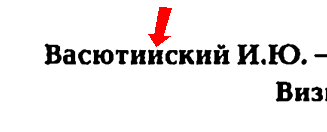
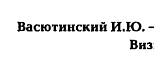

# jbig2enc-minidjvu

## Test.

Using [jbig2enc](https://github.com/agl/jbig2enc) in conjunction with [minidjvu-mod](https://github.com/trufanov-nok/minidjvu-mod).

### Test 02.

This material was taken randomly in 2024 to test not only classification errors, but also the degree of compression.

| Destination | Screen | Params |
| --- | --- | --- |
| [test02_jbig2-ccitt_group_4.pdf](./dest/test02_jbig2-ccitt_group_4.pdf) |  | no JBIG2 |
| [test02_jbig2-t_0_85.pdf](./dest/test02_jbig2-t_0_85.pdf) |  | `-t 0.85` |
| [test02_jbig2-t_0_92.pdf](./dest/test02_jbig2-t_0_92.pdf) |  | `-t 0.92` |
| [test02_jbig2-minidjvu-t_0_92.pdf](./dest/test02_jbig2-minidjvu-t_0_92.pdf) |  | after `minidjvu-mod`, `-t 0.92` |

```shell
ls -1s dest
```

```shell
772 test02_jbig2-ccitt_group_4.pdf
244 test02_jbig2-t_0_85.pdf
392 test02_jbig2-t_0_92.pdf
200 test02_jbig2-minidjvu-t_0_92.pdf
```
